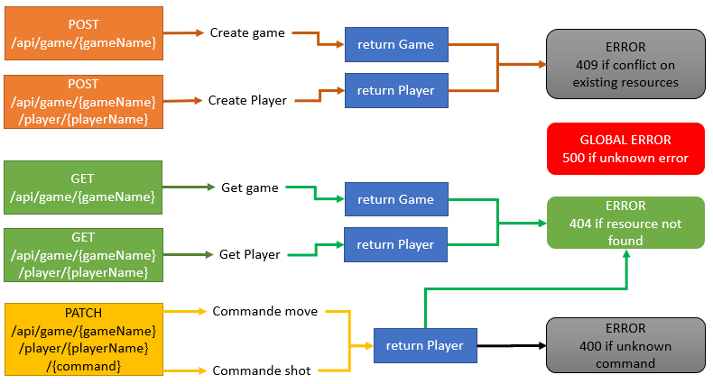
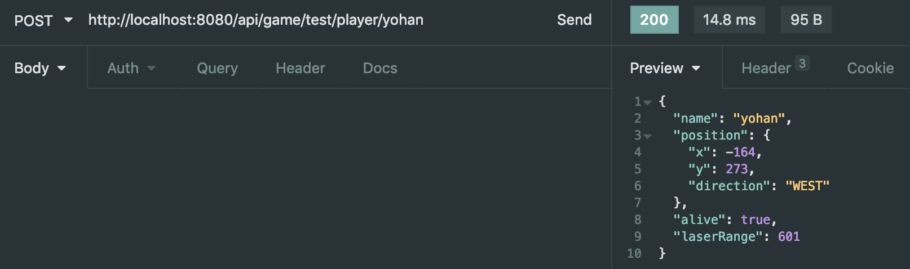
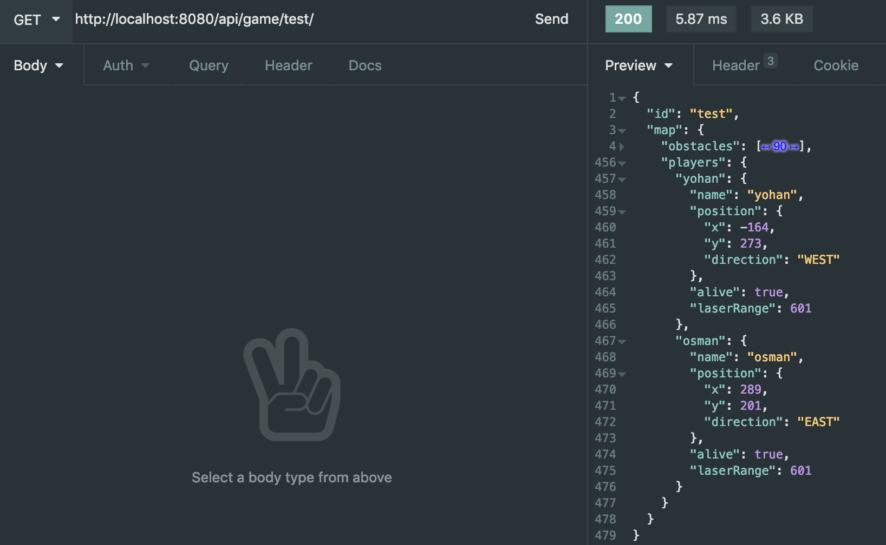
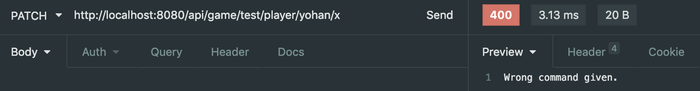
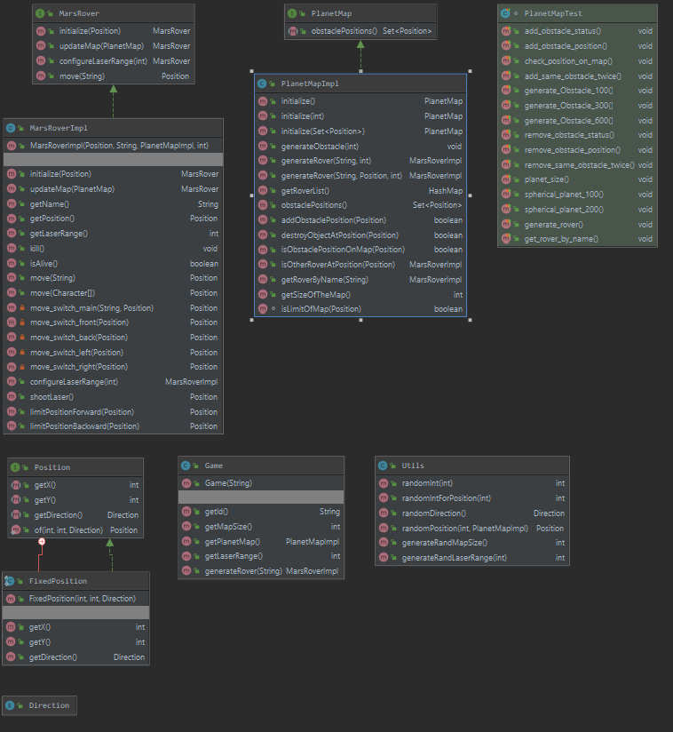

# Architecture logicielle : Mars Rover

# Introduction

Le projet consiste à concevoir un système de jeu qui permet de gérer un Mars Rover envoyé sur une autre planète et devant se battre contre d'autres Mars Rover. 

Ce système est composé de commandes qui permettent de gérer les déplacements de ce Mars Rover. Ces instructions lui seront envoyées à distance.

Nous détaillons dans ce dossier la conception de ce Mars Rover, l'architecture du logiciel ainsi que sa documentation.

# Conception du système initial

Les joueurs interagiront en temps réel, chaque interaction actualisera la map afin que tous les joueurs présents sur la map voient la map en temps réel.

Les données du jeu seront stockées dans un fichier sur le serveur.

Chaque partie possède un id unique. Lorsqu'un joueur veut créer une partie, il rentre un nom qui correspond à l'id. L'utilisateur peut partager l'id de la partie pour inviter d'autres joueurs.

Les parties sont sauvegardées à chaque action. Si le serveur plante, la partie peut redémarrer une fois le serveur remis en ligne.

Les joueurs pourront s'authentifier avec leurs pseudos uniques et leurs mots de passe. Chaque joueur verra sa progression sauvegardée à chaque interaction.

Notre serveur accepte uniquement un nombre de connexions précis. Il n'est donc pas possible de dépasser le nombre prévu.

# Architecture du Mars Rover

Ci-dessous l'architecture de notre API et les cinq méthodes possibles.

Il existe plusieurs erreurs en fonction des situations dont une qui est globale, l'erreur 500.

Quelques exemples de retour API :

Création d'un utilisateur sur la partie "test" (la partie a été créée avant) :

POST http://localhost:8080/api/game/test/player/yohan

Récupération d'une partie "test":

GET http://localhost:8080/api/game/test

Exemple de retour d'erreur (une commande inconnue envoyée au rover):

PATCH http://localhost:8080/api/game/test/player/yohan/x/

## Diagramme 

Ci-dessous les diagrammes UML du Mars Rover

## Framework

Nous avons décidé d'utiliser le Framework Spring qui nous a permis de réaliser notre API.
Il permet via des annotations de créer des endpoints. Il permet aussi de créer des tests unitaires facilement.
De plus, l'API Spring respecte l'architecture MVC.

## Débogage et TDD

Tout le long du projet, nous avons rencontré des bugs et effectué en parallèles de tests.

Pour cela nous avons utilisé la méthode TDD (Test-Driven Development) qui nous a permis d'éviter de perdre beaucoup de temps et d'avoir une méthode de développement commune.

Nous avons utilisé Maven qui est un outil de gestion et d'automatisation de production qui nous a permis de réaliser ces diffférents tests et d'appliquer la méthode TDD.
